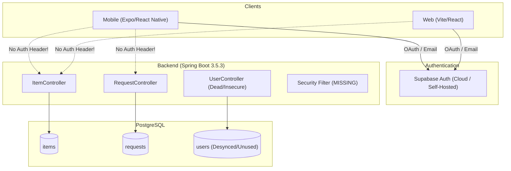

# Wasteless Codebase Audit Report
**Target Document**: `docs/issues-plan.md` (`feat/issues` branch)  
**Audit Scope**: Issue #17 (Item Requests), Issue #8 (Backend JWT Verification), Issues #5 & #6 (Google Auth on Web & Mobile), and overall architecture.

---

## Executive Summary

The investigation in `docs/issues-plan.md` provides an accurate foundation: all cited file paths, line references, and primary problem statements match the current repository state (`feat/issues` at commit `e5a240f`).

However, this audit uncovered **critical hidden bugs, architectural gaps, and unverified assumptions** that directly impact the fix plan:
1. **Web Google Auth is NOT fully working**: Successful login navigates to `/user/dashboard` which does not exist in `AuthRoutes.tsx` (renders 404 `NotFound`), leaks foreign branding ("Health Tracker"), and uses an erroneous filename with a trailing space (`OAuthCallback .tsx`).
2. **Neither client sends `Authorization` headers**: Neither mobile (`frontend/api/api_client.ts`) nor web (`web/src/api/api_client.ts`) attaches JWT Bearer tokens. Deploying backend auth (#8) without client interceptors will immediately break all existing write calls.
3. **Backend `users` table is disconnected from Supabase**: Neither mobile nor web registers users into the backend `users` table. The plan's proposal to get requester display names via database joins will fail without a synchronization mechanism or persisting requester metadata on the request entity itself.
4. **Undocumented Backend Bugs in #17**:
   - `ItemRequestServiceImpl.java:44` sets location on `item` instead of `itemRequest`, leaving `itemRequest.location` permanently `null`.
   - `RequestCreationDTO.java` applies `@NotBlank` to `java.util.UUID` fields, which is invalid in Jakarta Validation and will crash if `@Valid` is triggered.
   - Any user can create a request for their own item (no self-request check).
   - In `RequestController.java`, every GET and PATCH endpoint returns HTTP 201 `CREATED` instead of 200 `OK`.

---

## Section-by-Section Audit

### 1. Issue #17 — Item Requests

#### Backend Audit

| Claim in `issues-plan.md` | Verification Status | Details & Line Audit |
|---|---|---|
| Create request (dup-prevented) | ✅ Verified (with additional bugs found) | `RequestController.java:25-29` → `ItemRequestServiceImpl.java:30-47`. Throws `ConflictException` (409) if duplicate request exists. <br>⚠️ **Unreported Bug 1**: Line 44 executes `item.setLocation(dto.getLocation())` instead of `itemRequest.setLocation(...)`. `itemRequest.location` is never set, and `item` is never persisted.<br>⚠️ **Unreported Bug 2**: No check prevents users from requesting their own items (`item.getUserId().equals(dto.getUserId())`).<br>⚠️ **Unreported Bug 3**: `RequestCreationDTO.java:9-13` uses `@NotBlank` on `UUID` fields (`userId`, `itemId`). `@NotBlank` is only valid on `CharSequence`. Adding `@Valid` will throw `UnexpectedTypeException`. |
| List incoming/outgoing/by-id | ✅ Verified | `RequestController.java:30-49`. `ItemRequestRepo.java:14-23`. <br>⚠️ **Observation 1**: `getIncomingRequestsByUserId` queries `WHERE r.status = 0` (PENDING only). Owners cannot view previously accepted, rejected, or completed requests.<br>⚠️ **Observation 2**: All `GET` endpoints in `RequestController` return HTTP 201 `CREATED` instead of 200 `OK`. |
| Owner accept/reject | ✅ Verified Buggy | `ItemRequestServiceImpl.java:89-111`. In `acceptRequest` (lines 90-103), sibling requests are rejected and saved, but `itemRequestRepo.save(itemRequest)` is never invoked. In `rejectRequest` (lines 106-111), `save()` is never invoked. Without `@Transactional` on the class, dirty checking does not flush changes to PostgreSQL. |
| Mark request fulfilled | ✅ Verified Missing | `RequestStatus.java:3-8` declares `FULFILLED`, but it is nowhere else in backend, mobile, or web code. |
| Item becomes unavailable once given away | ✅ Verified Missing | `Item.java` has no `available` or status field. `ItemRepository.java:15-67` geospatial queries do not filter by status. |
| Requester cancel/withdraw | ✅ Verified Partial | `RequestController.java:62-65` only exposes `DELETE /requests/{id}` with no authorization or status verification. |
| Requester identity on a request | ✅ Verified Missing (Architectural Conflict) | `ItemRequest.java:21` has only `UUID userId`. There is no JPA relation to `User`. Furthermore, backend `users` table is never written to during Supabase authentication; querying `users` by `userId` will return `null` unless requester metadata is attached upon request creation. |

#### Frontend (Mobile) Audit

| Claim in `issues-plan.md` | Verification Status | Details & Line Audit |
|---|---|---|
| Outgoing requests list → details | ✅ Verified | `my-requests.tsx:107-109` maps `requestsToShow` to `OutgoingRequestItemCard.tsx:22-27`, which navigates to `/request-details` passing serialized JSON. |
| Incoming requests list | ✅ Verified Broken | `my-requests.tsx:108` renders `<OutgoingRequestItemCard>` regardless of whether `selectedTab` is `"Incoming"` or `"Outgoing"`. `IncomingItemRequest.tsx` is completely unused and lacks an `onPress` navigation handler. |
| Accept / reject UI | ✅ Verified Missing | Zero references to `/requests/{id}/accept` or `/requests/{id}/reject` in `frontend/`. |
| Cancel request button | ✅ Verified Stub | `request-details.tsx:27` defines `const handleCancelRequest = () => {};` wired to a visible button at line 121. |
| Create request flow | ✅ Verified Done | `request_item.tsx:79-107` executes `POST /requests` with 409 conflict handling. |
| Requester name in UI | ✅ Verified Missing | `IncomingItemRequest.tsx:13` and `my-requests.tsx:55` look for `request.requested_by?.display_name`. Backend `User` has `name` and `username`, but no `display_name`, and `ItemRequest` has no nested user object. |

#### Web Client Audit

| Claim in `issues-plan.md` | Verification Status | Details & Line Audit |
|---|---|---|
| Requesting not exposed | ✅ Verified | `web/src/components/item-card.tsx:72-74` has a button `<Button variant="outline">Request Item</Button>` with no `onClick`. No `/requests` endpoints called in `web/src`. |

---

### 2. Issue #8 — Backend JWT Verification Middleware

| Claim in `issues-plan.md` | Verification Status | Details & Line Audit |
|---|---|---|
| Zero auth infrastructure in backend | ✅ Verified | No Spring Security, no JWT libraries, no security filters, no Supabase configuration in `pom.xml` or `backend/src/`. |
| Mutations trust unverified `userId` | ✅ Verified | - `ItemCreationDTO.userId`: passed by client, used in `ItemServiceImplementation.java:39, 45`.<br>- `ItemController.updateItem` (line 60) & `deleteItemById` (line 78): no user verification.<br>- `RequestController` accept/reject/delete: no verification of owner or requester.<br>- `UserController.java:55-65`: `getAllUsers` returns all entities including plaintext passwords. `updateUser` and `deleteUserById` have zero checks. |
| Global exception handling | ✅ Verified | `GlobalExceptionHandler.java:17-27` only intercepts `ResourceNotFoundException`. Missing 401 (`AuthenticationException`), 403 (`AccessDeniedException`), 409 (`ConflictException`), and 400 (`MethodArgumentNotValidException`, `NotValidUUIDException`). |
| Verification of Client `Authorization` Headers (Step 8 check) | ⚠️ **Critical Gap Confirmed** | **Neither client attaches Bearer tokens.** <br>- `frontend/api/api_client.ts`: Axios instance configured without auth headers or interceptors.<br>- `web/src/api/api_client.ts`: Axios instance configured without auth headers or interceptors.<br>Enforcing JWTs on the backend will break both clients immediately unless interceptors are added. |
| Supabase User vs Backend User | ⚠️ **Architectural Disconnect** | The backend `User` entity is not synchronized with Supabase Auth `auth.users`. Clients never call `/users`. Treating `User` as a database entity for authentication is redundant and insecure. |

---

### 3. Issues #5 & #6 — Supabase Google Login / Signup

#### Web Audit

| Claim in `issues-plan.md` | Verification Status | Details & Line Audit |
|---|---|---|
| "Fully working on web" | ❌ **Partially Incorrect / Has Bugs** | While OAuth initiation works via `Login.tsx:79-94` and `Signup.tsx:103-112`, callback handling has multiple bugs:<br>1. **Dead Route**: `OAuthCallback .tsx:17` calls `navigate("/user/dashboard")`. There is no `/user/dashboard` route in `AuthRoutes.tsx` or `App.tsx`—the user is dumped onto `NotFound`.<br>2. **Template Leftover**: `OAuthCallback .tsx:20` displays `"Welcome to Health Tracker!"`.<br>3. **Filename / Import Typo**: Filename is literally `OAuthCallback .tsx` with a trailing space, imported as `import OAuthCallback from "@/pages/auth/OAuthCallback ";`.<br>4. **Inconsistent LocalStorage**: `Signup.tsx:119` writes to key `"user"`, while `OAuthCallback .tsx:16` writes to key `"auth"`. |
| Missing `web/.env.example` | ✅ Verified | `web/.env.example` does not exist. `web/src` requires `VITE_PUBLIC_SUPABASE_URL`, `VITE_PUBLIC_SUPABASE_ANON_KEY`, `VITE_PUBLIC_API_URL`, and `VITE_GOOGLE_REDIRECT_URI`. |

#### Mobile Audit

| Claim in `issues-plan.md` | Verification Status | Details & Line Audit |
|---|---|---|
| Buttons stubbed and commented out | ✅ Verified | `login.tsx:82-89` and `register.tsx:150-156` have commented-out Google buttons. Commit `dd18630` disabled them. |
| Deep link configuration | ✅ Verified | `app.json:7` specifies `"scheme": "wasteless"`. |
| Dependencies ready | ✅ Verified | `expo-web-browser: ~14.2.0` and `expo-linking: ~7.1.7` are already installed in `frontend/package.json`. No new npm packages needed. |

---

## Architectural & Cross-Cutting Findings



### 1. The "Ghost" User Entity
The backend contains a complete CRUD suite for `User` (`UserController`, `UserService`, `UserRepository`, `User` entity with plaintext `password`). Neither mobile nor web ever calls `/users`. Instead, clients register directly with Supabase. 
- The `userId` stored in `items` and `requests` is the Supabase UUID.
- If backend #8 is implemented, the backend will validate Supabase JWTs and extract `sub` (Supabase UUID).
- **Recommendation**: Deprecate `UserController` and remove the plaintext `User.password` entity. If user profiles are needed in the backend database, create a lightweight read-only or sync-on-demand `UserProfile` table keyed by Supabase UUID.

### 2. Client Interceptor Prerequisite
Step 8 of #8 in `issues-plan.md` questioned whether clients send tokens. They do not. Therefore, adding Spring Security in #8 will break both apps unless client updates are released in tandem.
- `frontend/api/api_client.ts` needs an Axios request interceptor:
  ```ts
  apiClient.interceptors.request.use(async (config) => {
    const { data } = await supabase.auth.getSession();
    if (data.session?.access_token) {
      config.headers.Authorization = `Bearer ${data.session.access_token}`;
    }
    return config;
  });
  ```
- `web/src/api/api_client.ts` requires the identical interceptor.

---

## Review & Refinement of `issues-plan.md` Fix Plans

### Adjustments to Fix Plan #17 (Item Requests)
1. **Fix `createRequest` location assignment**: Change `item.setLocation(dto.getLocation())` to `itemRequest.setLocation(dto.getLocation())` (`ItemRequestServiceImpl.java:44`).
2. **Prevent self-requests**: In `createRequest`, verify `!item.getUserId().equals(dto.getUserId())` and throw `ConflictException` or `BadRequestException` if equal.
3. **Fix Jakarta validation types**: Change `@NotBlank` on `UUID` fields in `RequestCreationDTO` to `@NotNull`.
4. **Requester Display Name Strategy**: Rather than attempting a DB join against an unpopulated `users` table, include `requesterName` in `ItemRequest` entity and populate it either from JWT metadata (`user_metadata.full_name`) or request DTO.
5. **Standardize HTTP responses**: Fix `RequestController` returning HTTP 201 for `GET` and `PATCH` methods.
6. **Support Incoming History**: Update `ItemRequestRepo.getIncomingRequestsByUserId` or add a filter parameter so owners can view requests other than `status = 0` (PENDING).

### Adjustments to Fix Plan #8 (JWT Verification)
1. **Mandatory Client Axios Interceptors**: Must be built and tested as part of the PR, not deferred.
2. **Handle Exceptions**: Update `GlobalExceptionHandler` to produce consistent JSON error structures for 401, 403, and 400.
3. **Prune / Secure `UserController`**: Prevent unauthenticated data dumps of `User` entities containing plaintext passwords.

### Adjustments to Fix Plan #5 & #6 (Google Auth)
1. **Fix Web Callback Route**: Update `web/src/pages/auth/OAuthCallback .tsx` to navigate to `/profile` or `/` instead of the non-existent `/user/dashboard`.
2. **Clean up Web file names & copy**: Rename `OAuthCallback .tsx` (remove trailing space), fix import in `AuthRoutes.tsx`, and change "Welcome to Health Tracker!" to "Welcome to Wasteless!".
3. **Add `web/.env.example`**: Specify `VITE_PUBLIC_SUPABASE_URL`, `VITE_PUBLIC_SUPABASE_ANON_KEY`, `VITE_PUBLIC_API_URL`, and `VITE_GOOGLE_REDIRECT_URI`.
4. **Mobile Implementation**: `expo-web-browser` and `expo-linking` are already present in `package.json`; proceed directly with the standard Supabase Expo pattern.
